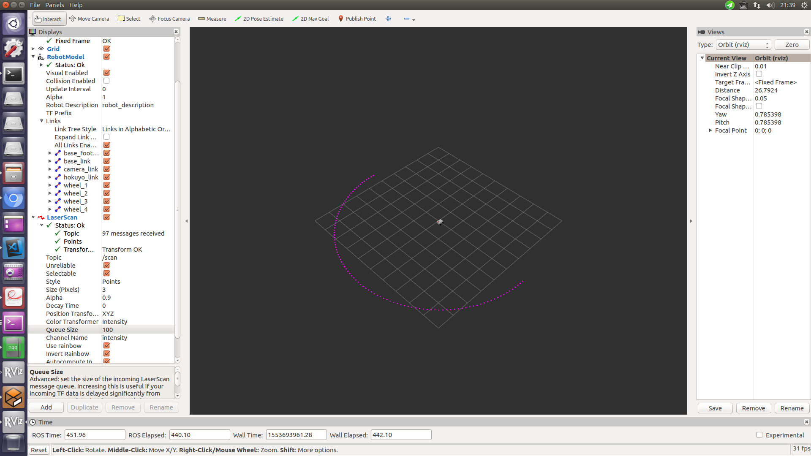
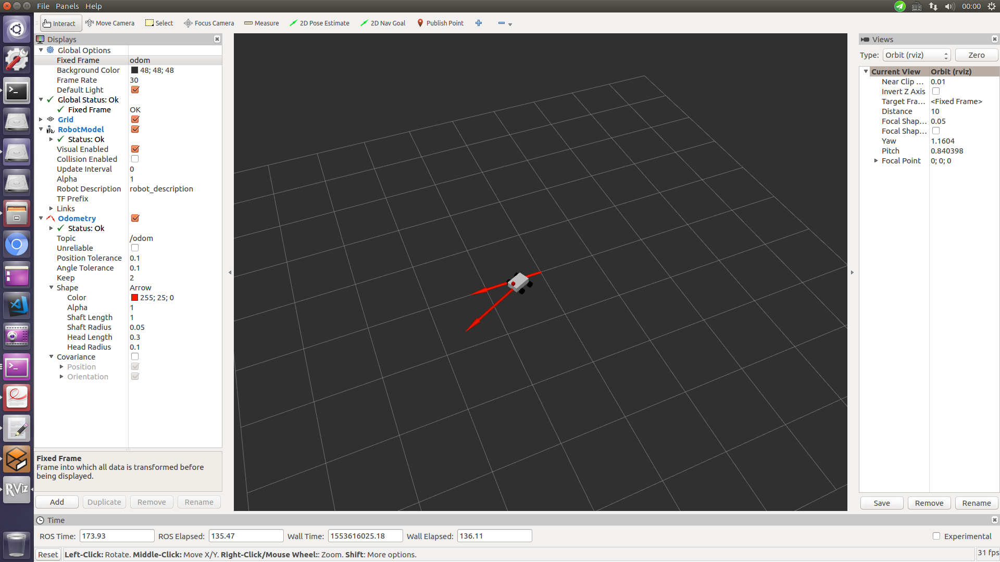
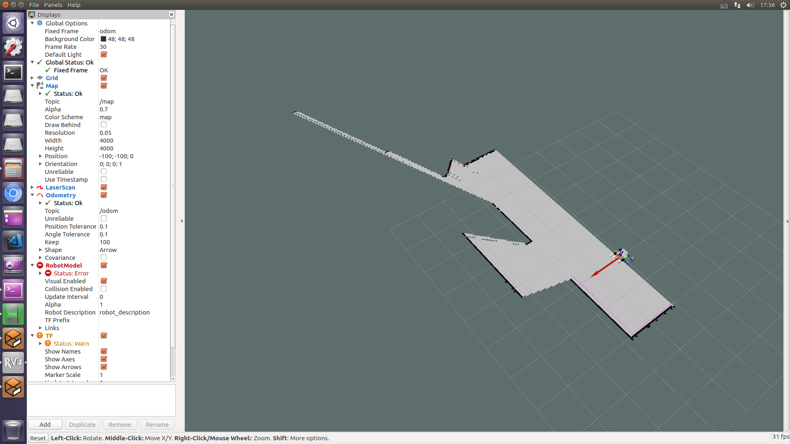
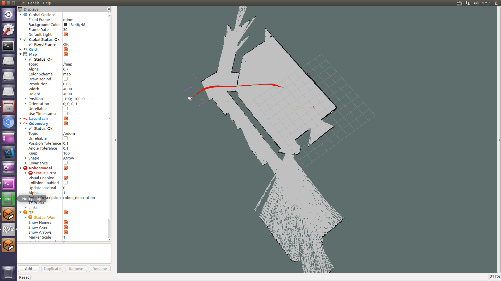
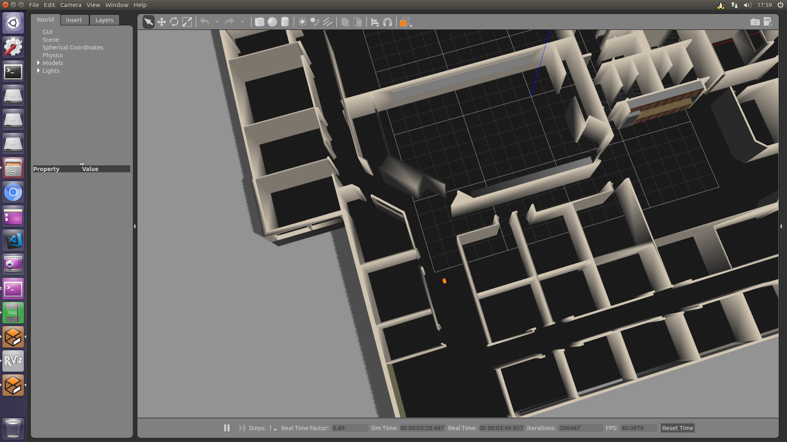

# install dependencies
`sudo apt-get install ros-kinetic-gazebo-ros-pkgs`
`sudo apt-get install ros-kinetic-gazebo-ros-control`
`sudo apt-get install ros-kinetic-gmapping`

`wget https://bitbucket.org/osrf/gazebo_models/get/e6d645674e8a.zip`
`unzip e6d645674e8a.zip`
`mv xxx models`
`mv models ~/.gazebo`

# pull up gazebo
`roslaunch jst_laser gazebo_xacro.launch model:="`rospack find jst_laser`/urdf/robot1_base_04.xacro"`

# bring up rviz
`rviz`

# create laser
`rosrun jst_laser my_Laser`

# create odom
`rosrun jst_laser odom`

# add rviz plugin
 RobotModel, LaserScan and Odometry

# mapping creation and controller
`roslaunch create_map gazebo_mapping_xacro.launch model:="`rospack find create_map`/urdf/robot1_base_04.xacro"`
`rosrun teleop_twist_keyboard teleop_twist_keyboard.py`

# how to control
`u` - turn front left
`o` - turn front right
`,` - turn rear left
`.` - turn rear right
`i` - move forward
`k` - stop

# save map
`rosrun map_server map_saver -f map`

